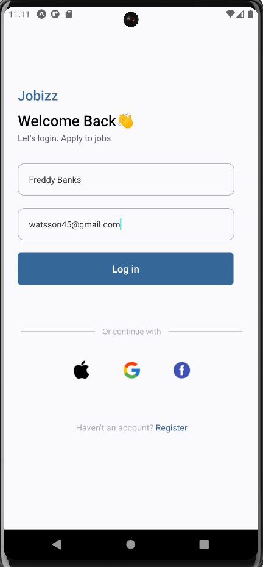

### Mobile application for Jobizz

#### Component discription

###### useState hook
The useState hook is used to keep track of change whithin our code.

###### TextInput
The TextInput component allows us to recieve user inputs on our app.

###### View
The View component helps in rendering and organizing the contents of our app.

###### StyleSheet
The StyleSheet component allows us to define and apply CSS-like styling to our components as JavaScript objects.

###### Text
The Text component allows us to render words or statement in our app.

###### Image
The Image component allows us to render images in our app.

###### Card and SubCard
The Card and SubCard components are custom component used by our FlatList to render each item efficiently, leveraging the memoization technique to optimize render times by preventing unnecessary re-renders.

### Login Screen

### Home Screen

